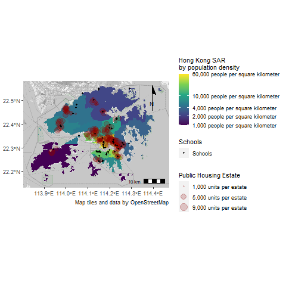
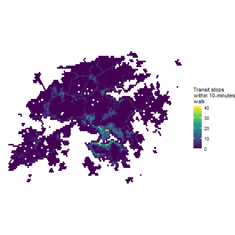
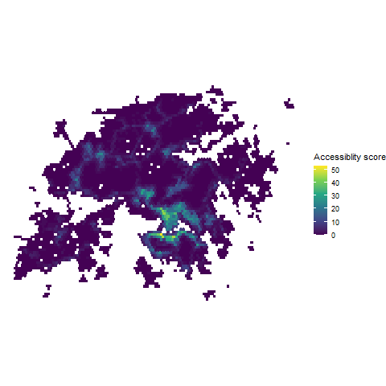
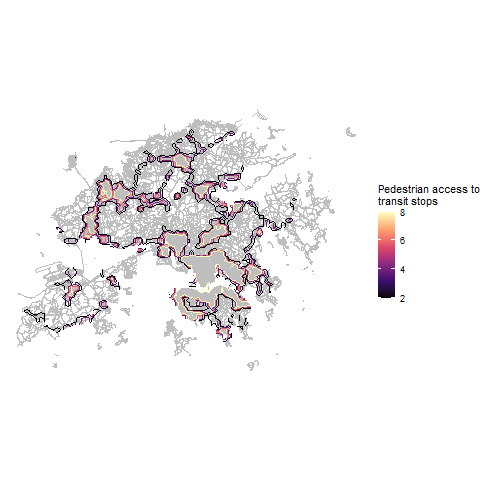
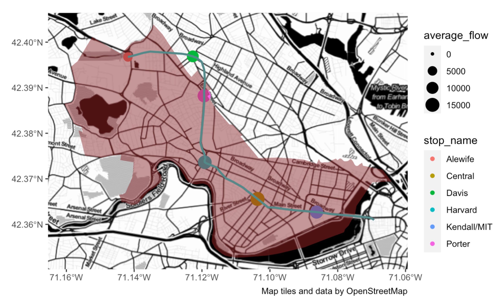
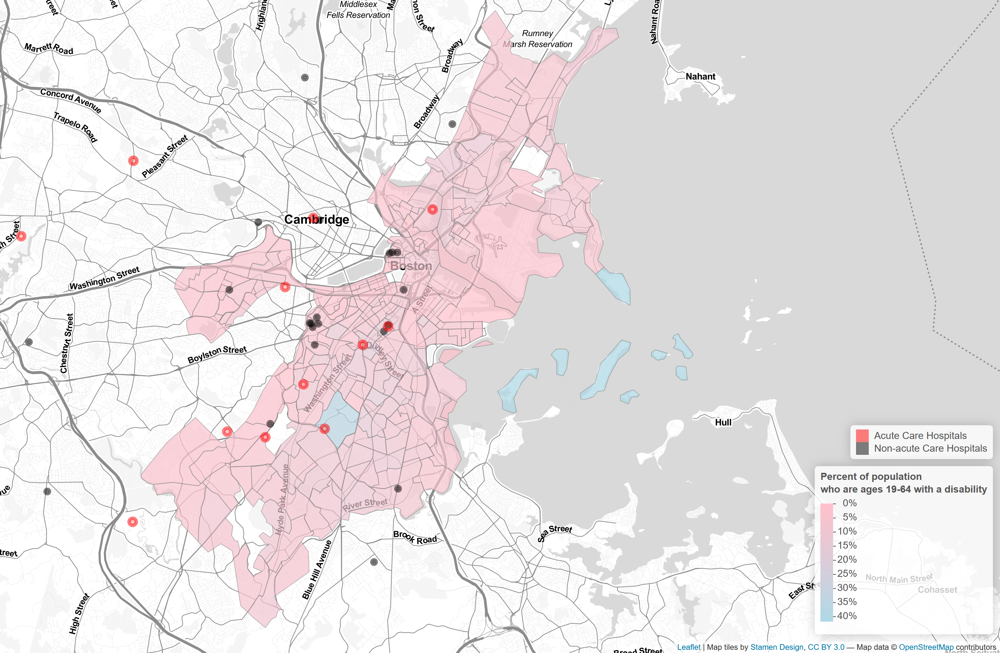
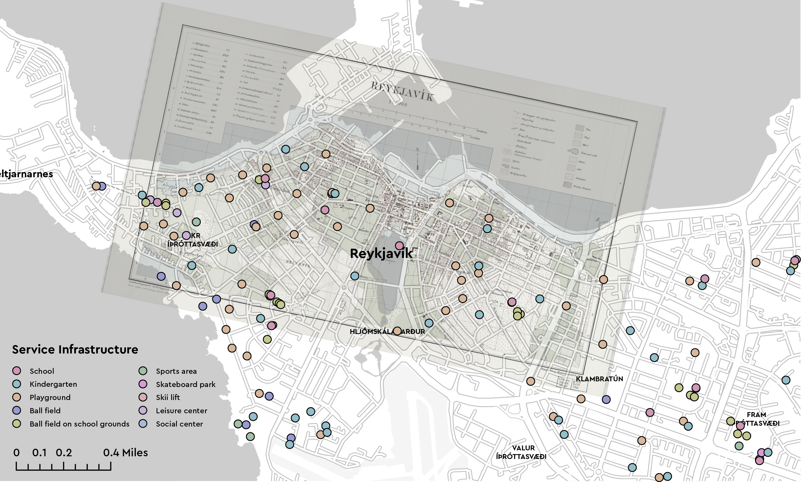

```{r setup, include=FALSE}
knitr::opts_chunk$set(echo = TRUE)
```

# Introduction

This portfolio is a collection of the skills developed in VIS 2128 taught by Professor Carole Voulgaris. 


Your portfolio should demonstrate each of the following skills (not all of which are demonstrated in this example):

* Displaying multiple vector layers on the same map
* Calculating and displaying relationships among point and polygon layers based on distance
* Aggregating point data to a layer of polygons
* Calculating and displaying accessibility, based on travel time
* Converting between raster layers and vector layers
* Displaying raster data on a map
* Georeferencing a raster image
* Displaying data on an interactive map

# Lessons through maps and map making


## Map 1: On accessibility in Hong Kong

[](https://strctre.github.io/portfolio/fullsize/density_hk.pdf){target="_blank"}

As a context for the subsequent maps regarding accessibility in Hong Kong, this map gives one an idea of the public housing, schools and population density landscape in the city and how its accounts for the observations in later maps. This map also serves to demonstrate the following skills:
 * Displaying multiple vector layers on the same map 
 * Calculating and displaying relationships among point and polygon layers based on distance

### Maps 2 & 3: Access to transit stops
[](https://strctre.github.io/portfolio/fullsize/accessibility_timee.pdf){target="_blank"}

[](https://strctre.github.io/portfolio/fullsize/accessibility_score.pdf){target="_blank"}

These map demonstrate:
 * Calculating and displaying accessibility, based on travel time
 
### Map 4: Pedestrian access to transit tops (Raster layer)
[](https://strctre.github.io/portfolio/fullsize/pedestrian_access_contours.pdf){target="_blank"}

This map demonstrates:
 * Displaying raster data on a map
 * Calculating and displaying accessibility, based on travel time

### Map 5: Pedestrian access to transit tops (Vector layer)
[](https://strctre.github.io/portfolio/fullsize/pedestrian_access_contours.pdf){target="_blank"}

This map demonstrates:
 * Converting between raster layers and vector layers
 * Calculating and displaying accessibility, based on travel time

## On ridership in Cambridge

### Map 6: Ridership at different time periods
[](https://strctre.github.io/portfolio/fullsize/ridership_cambridge.pdf){target="_blank"}

This was the first assignment that introduced map making in R.
The skills demonstrated are 
 * Aggregating point data to a layer of polygons
 
Unique to our group, we needed to geo-reference the data set for ridership in R by joining the subway line shapefile to the ridership csv file.

## On access to hospitals for persons with a disability in Suffolk County, MA
### Map 7: Interactive map on access to hospitals for persons with a disability in Suffolk County, MA
This interactive map demonstrates the following skills: 

* Displaying data on an interactive map

[](https://strctre.github.io/portfolio/fullsize/assignment_6_tang.html){target="_blank"}


## On Reykjavik, 1902 and today
### Map 8: Service infrastructure in Reykjavik today with reference to the city in 1902

[](https://strctre.github.io/portfolio/fullsize/service_infrastructure_lei.pdf){target="_blank"}

This map shows the service infrastructure in Reykjavík today as the top layer. The historical 1902 map is the second layer at 50% transparency. It overlays the contemporary map. In this order, the service infrastructure which has sprawled out of old Reykjavík, is denoted by a circle. The various types are differentiated by the color of the circle’s fill. We observe “playgrounds” are the largest group and is distributed across old and new Reykjavík, shedding light onto the possibly playful daily life of Icelandic children and their society’s priority for them.

This map demonstrates:
 
 * Geo-referencing a raster image

