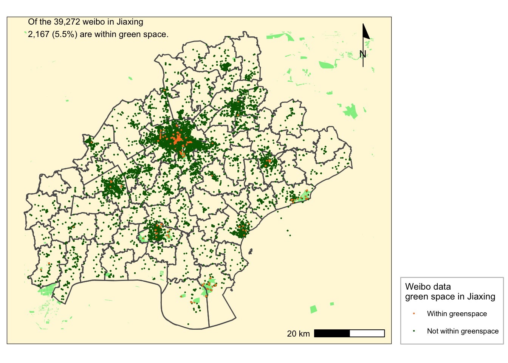

```{r setup, include=FALSE}
knitr::opts_chunk$set(echo = TRUE)
```

# Lessons through maps and map making

This portfolio is a collection of the skills developed in VIS 2128 taught by Professor Carole Voulgaris. 
The order of these maps are not chronological, instead, they follow a vein that examines what a city provides in terms of access to where an individual interacts with the digital sphere in a city.

## On accessibility in Hong Kong

Map 1

[](https://strctre.github.io/portfolio/fullsize/density_hk.pdf){target="_blank"}

As a context for the subsequent maps regarding accessibility in Hong Kong, this map gives one an idea of the public housing, schools and population density landscape in the city and how they account for the observations in later maps. This map also serves to demonstrate the following skills:

* Displaying multiple vector layers on the same map 
* Aggregating point data to a layer of polygons
* Calculating and displaying relationships among point and polygon layers based on distance

## Access to transit stops

Map 2

[](https://strctre.github.io/portfolio/fullsize/accessibility_time.pdf){target="_blank"}

Map 3

[](https://strctre.github.io/portfolio/fullsize/accessibility_score.pdf){target="_blank"}

These maps demonstrate:

* Calculating and displaying accessibility, based on travel time
 
## Pedestrian access to transit tops (Raster layer)

Map 4

[](https://strctre.github.io/portfolio/fullsize/pedestrian_access_raster.pdf){target="_blank"}

This map demonstrates:

* Displaying raster data on a map
* Calculating and displaying accessibility, based on travel time

## Pedestrian access to transit tops (Vector layer)

Map 5

[](https://strctre.github.io/portfolio/fullsize/pedestrian_access_contours.pdf){target="_blank"}

This map demonstrates:

* Converting between raster layers and vector layers
* Calculating and displaying accessibility, based on travel time

## On ridership in Cambridge

Map 6

[](https://strctre.github.io/portfolio/fullsize/ridership_cambridge.pdf){target="_blank"}

This was the first assignment that introduced map making in R.
The skills demonstrated are:

* Aggregating point data to a layer of polygons
 
Unique to our group, we needed to geo-reference the data set for ridership in R by joining the subway line shapefile to the ridership csv file.

## On access to hospitals for persons with a disability in Suffolk County, MA

Map 7

This interactive map demonstrates the following skills: 

* Displaying data on an interactive map

[](https://strctre.github.io/portfolio/fullsize/assignment_6_tang.html){target="_blank"}


## On Reykjavik, 1902 and today

Map 8

[](https://strctre.github.io/portfolio/fullsize/service_infrastructure_lei.pdf){target="_blank"}

This map shows the service infrastructure in Reykjavík today as the top layer. The historical 1902 map is the second layer at 50% transparency. It overlays the contemporary map. In this order, the service infrastructure which has sprawled out of old Reykjavík, is denoted by a circle. The various types are differentiated by the color of the circle’s fill. We observe “playgrounds” are the largest group and is distributed across old and new Reykjavík, shedding light onto the possibly playful daily life of Icelandic children and their society’s priority for them.

This map demonstrates:
 
* Geo-referencing a raster image

## On use of social media in green spaces in Jiaxing

Map 9

[](https://strctre.github.io/portfolio/fullsize/weibo_within_greenspace.pdf){target="_blank"}

This map, as others, are part of a group effort, in which we all tried to ensure the codes and data would run. The primary author of this particular map is my group mate Yuanzhao Wang. Yuanzhao, Marina Freitas and I all worked on all the maps (and their codes) produced for this assignment as we attempt to collate our maps and knit.
The full assignment can here accessed [here](https://strctre.github.io/portfolio/fullsize/Assignment_3_21.html)

This map demonstrates:

* Aggregating point data to a layer of polygons